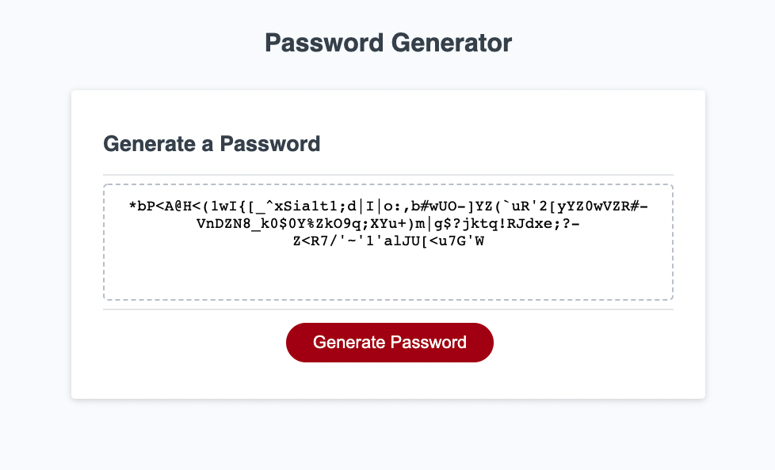

# portfolio

## Description

This is a password generating app, developed with JavaScript. Here is a [link to the deployed page](https://ajolsavsky.github.io/password-generator/).

Some things that I learned while creating this project:

- This was my first JavaScript adventure, so I really felt like I was learning everything all at once!
- I started out with writing the entire operation within one function, and then later was able to clean this up and pull this out to make this more developer-friendly going forward
- While the individual prompts ended up being fairly straightforward, the trickiest part was the final randomized result. I ended up using an array method, pushing individual results into an empty array, and then converting that into a string. I looked up the math.Random, .length, and .charAt methods to help achieve what I wanted, and now it seems to work smoothly
- I did try using a pseudocode method at the beginning to help organize my mind, and found this very helpful
- Final lesson was remembering how/why the "return" portion of a function was essential (thank you to my tutor) for logging the final result to the broswer window!

## User Story

```
AS AN employee with access to sensitive data
I WANT to randomly generate a password that meets certain criteria
SO THAT I can create a strong password that provides greater security
```


## Acceptance Criteria

```
GIVEN I need a new, secure password
WHEN I click the button to generate a password
THEN I am presented with a series of prompts for password criteria
WHEN prompted for password criteria
THEN I select which criteria to include in the password
WHEN prompted for the length of the password
THEN I choose a length of at least 8 characters and no more than 128 characters
WHEN asked for character types to include in the password
THEN I confirm whether or not to include lowercase, uppercase, numeric, and/or special characters
WHEN I answer each prompt
THEN my input should be validated and at least one character type should be selected
WHEN all prompts are answered
THEN a password is generated that matches the selected criteria
WHEN the password is generated
THEN the password is either displayed in an alert or written to the page
```

## Usage

Here is an example of the final page.



## Credits

This project and related assets are associated with the Triolgy Coding Bootcamp.

## License

© 2022 Trilogy Education Services, LLC, a 2U, Inc. brand. Confidential and Proprietary. All Rights Reserved.
